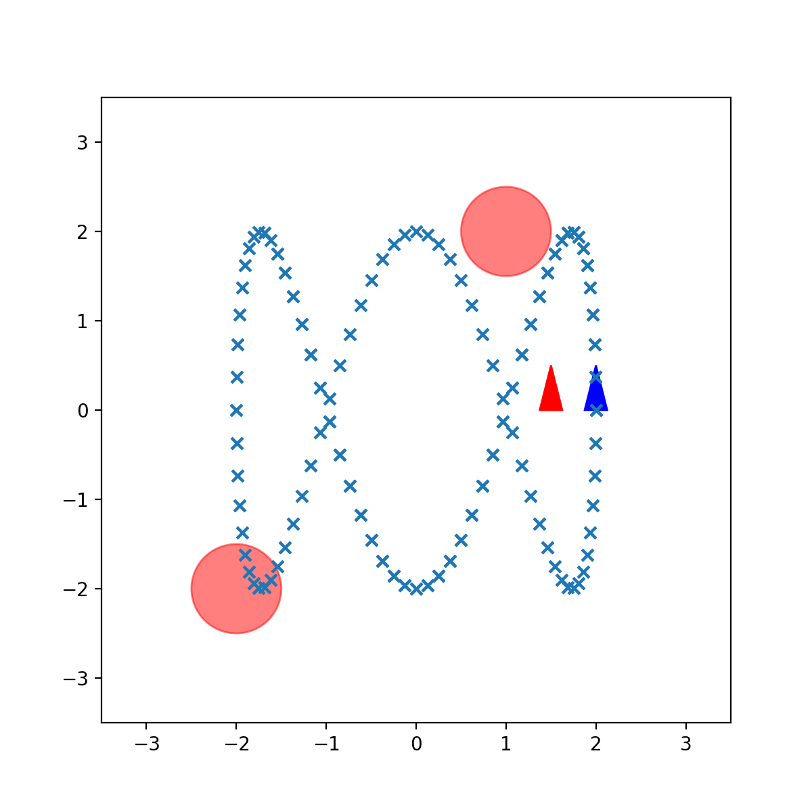

# Stochastic Optimal Control
## Overview
This code implements a trajectory following algorithm as an infinite horizon optical control problem. It is solved in 2 ways.

### Receding-horizon certainty equivalent control (CEC):
The main idea is to reduce a stochastic optimal control problem into a deterministic optimal control problem.
Receding horizon CEC further converts the deterministic optimal control problem into finite horizon deterministic optimal control problem. This is a suboptimal control sequence that will be optimal if the noise in the motion model were to be zero.

### Generalized Policy Iteration
GPI is a way to directly solve for the optimal value function and optimal control problem formulated as discounted infinite horizon stochastic optimal control problem. The given objective function can be converted to a bellman equation of the form:
$$
V^*([e_t,\tau]) = \min_{u} (l(e_t,u) + \gamma\mathbb{E}_{e_{t+1,t+1}\sim p_f(.|e_t,u)}[V^*([e_{t+1},\tau + 1])]
$$

The above equation can be solved by value iteration or policy iteration or generalized policy iteration.

The objective is to find an optimal value and policy using both these formulations.

## Results
|           Controller No Noise           |            Controller With Noise           |
| :-------------------------------------: | :--------------------------------------: |
|  |  |

## Code Implementation
### 1. main.py
This is the main entry point to the program. Uncomment/comment the controller to see it working.

### 2. cec_func.py
This file implements a CEC class which sets up the formulation and used a non linear solver called Casadi to find solutions.

### 3. gpi.py
This file implements a GPI class which solves the bellman equation using policy and value iteration.

### 4. utils.py
This file contains code for visualising and plotting the results.

### 5. frozenlake.py
This file implements value iteration and policy iteration for a specific forzen lake problem.
